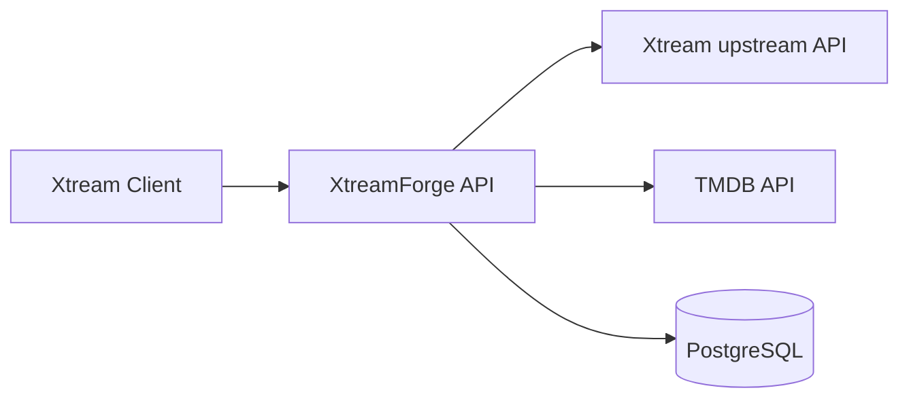

# XtreamForge

XtreamForge is an early-stage, self-hosted .NET application that will sit in front of an Xtream-compatible API and act as a transformation and enrichment layer.

> XtreamForge is an independent project and is not affiliated with Xtream Codes or TMDB.

## Current status

This repository currently provides the initial foundation only:

- ASP.NET Core application combining Minimal APIs and integrated Razor Pages administration UI
- Initial Xtream request routing, classification, and transparent forwarding foundation
- .NET Aspire orchestration
- PostgreSQL + EF Core infrastructure
- Docker Compose development setup
- xUnit test foundation

Category mapping, TMDB lookup, metadata rewriting, and authentication are intentionally out of scope for the current foundation.

## Architecture



### Projects

- `src/XtreamForge.Api` - Minimal APIs plus integrated Razor Pages admin UI with health and status endpoints
- `src/XtreamForge.Infrastructure` - EF Core, PostgreSQL wiring, options, migrations
- `src/XtreamForge.ServiceDefaults` - Aspire service defaults (OpenTelemetry, health checks, service discovery, resilience)
- `src/XtreamForge.AppHost` - Aspire orchestration for local development
- `tests/XtreamForge.Api.Tests` - API integration tests
- `tests/XtreamForge.Infrastructure.Tests` - Infrastructure-focused tests

## Prerequisites

- .NET SDK 10.0.x
- Docker (for PostgreSQL via Aspire or Docker Compose)

## Configuration

XtreamForge uses standard .NET configuration.

Placeholder configuration sections are present for future integrations:

- `Xtream:BaseUrl`
- `Xtream:Username`
- `Xtream:Password`
- `Tmdb:ApiKey`

Do not commit credentials.

For local secrets, prefer user-secrets or environment variables:

```bash
dotnet user-secrets --project src/XtreamForge.Api set "Xtream:BaseUrl" "https://example.test"
dotnet user-secrets --project src/XtreamForge.Api set "Xtream:Username" "your-user"
dotnet user-secrets --project src/XtreamForge.Api set "Xtream:Password" "your-password"
dotnet user-secrets --project src/XtreamForge.Api set "Tmdb:ApiKey" "your-tmdb-key"
```

Database connections are supplied through the standard `ConnectionStrings__database` setting.

## Run with .NET Aspire

From a clean clone:

```bash
dotnet restore
dotnet run --project src/XtreamForge.AppHost
```

The AppHost starts:

- PostgreSQL with persistent storage
- `XtreamForge.Api` (serving both API and administration UI)
- the Aspire dashboard

## Run with Docker Compose

```bash
docker compose up --build
```

This starts PostgreSQL and the single XtreamForge web service, which serves both the API and the administration UI.

Development-only defaults are used in `docker-compose.yml`:

- PostgreSQL database: `xtreamforge`
- PostgreSQL username: `postgres`
- PostgreSQL password: `postgres`

Override them for any non-local usage.

## PostgreSQL notes

- Aspire injects the database connection into the application.
- Docker Compose supplies the same connection via environment variables.
- The API attempts EF Core migrations in the background on startup by default.

## Xtream proxy

Xtream clients should call XtreamForge using a URL that embeds the original upstream destination:

```text
http://localhost:8080/{protocol}/{host}/{port}/{rest}?username=USER&******
```

Examples:

```text
http://localhost:8080/http/example.com/8080/player_api.php?username=user&******
http://localhost:8080/https/example.com/443/player_api.php?username=user&******
```

Current behavior:

- XtreamForge validates `protocol`, `host`, and `port`
- recognized `player_api.php` actions are classified for future transformation
- all requests are currently forwarded upstream unchanged
- request methods, bodies, headers, query strings, and streamed responses are preserved where appropriate

Recognized `player_api.php` actions:

- `get_vod_categories`
- `get_series_categories`
- `get_vod_streams`
- `get_series`
- `get_vod_info`
- `get_series_info`

Transparent fallback behavior:

- known action -> forwarded upstream unchanged
- unknown `player_api.php` action -> forwarded upstream unchanged
- `player_api.php` without `action` -> forwarded upstream unchanged
- non-`player_api.php` request -> forwarded upstream unchanged

Security notes:

- Xtream credentials in the query string are preserved for upstream forwarding but are not intentionally logged or persisted by this proxy layer.
- The proxy route allows a client to choose the upstream destination, which has SSRF implications. XtreamForge currently enforces an explicit destination validation policy for protocol, host, and port and is designed so stricter authorization rules can be added later.
- IPv4 addresses and DNS hostnames are supported in the route format today.
- IPv6 literals are not currently supported by this path-based route format.
- The generic Xtream proxy route is excluded from generated OpenAPI documentation to avoid misleading native API descriptions.

## Useful endpoints

- Dashboard UI: `http://localhost:8080/`
- API status: `http://localhost:8080/api/status`
- API health: `http://localhost:8080/health`

## Test

```bash
dotnet restore
dotnet build
dotnet test
```

The current test suite does not require a locally installed PostgreSQL instance.

## Known limitations

- Xtream requests are currently proxied transparently; category rewriting, filtering, and enrichment are not implemented yet
- No category remapping yet
- No TMDB client or enrichment yet
- No admin authentication yet
- No background jobs yet

## Suggested next steps

1. Add upstream Xtream client primitives.
2. Introduce category mapping persistence and admin workflows.
3. Add TMDB lookup/enrichment services.
4. Expand API compatibility coverage and health reporting.
