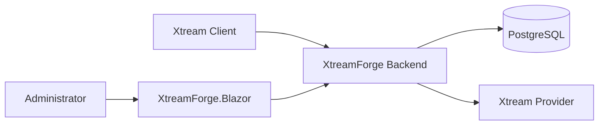

# XtreamForge

XtreamForge is an early-stage, self-hosted .NET application that sits in front of an Xtream-compatible API and acts as a transformation and enrichment layer.

> XtreamForge is an independent project and is not affiliated with Xtream Codes or TMDB.

## Current status

This repository currently provides the first backend and administration foundation:

- `XtreamForge` backend for Minimal APIs, Xtream proxying, category processing, and EF Core persistence
- `XtreamForge.Blazor` administration UI built as a Blazor Web App with Interactive Server rendering
- PostgreSQL persistence with EF Core and Npgsql
- .NET Aspire orchestration
- Docker Compose development setup
- xUnit test coverage for backend behavior and admin API endpoints

TMDB lookup, metadata rewriting beyond category translation, and authentication are intentionally out of scope for the current implementation.

## Architecture



### Design principles

- **Blazor Interactive Server** for the administration UI
- **Backend-owned business logic** for category discovery, rules, mappings, and Xtream transformations
- **Vertical Slice organization** inside `XtreamForge.Blazor` so each feature keeps its UI and HTTP client code together
- **KISS** over ceremony
- **Pragmatic SOLID** without repository layers, MediatR, CQRS infrastructure, AutoMapper, or interface-plus-implementation pairs that add no value

### Projects

- `src/XtreamForge` - backend ASP.NET Core application containing Minimal APIs, Xtream proxy behavior, EF Core models, migrations, and category/rule logic
- `src/XtreamForge.Blazor` - dedicated Blazor Web App for the administration UI using Interactive Server
- `src/XtreamForge.ServiceDefaults` - Aspire service defaults (OpenTelemetry, health checks, service discovery, resilience)
- `src/XtreamForge.AppHost` - Aspire orchestration for local development
- `tests/XtreamForge.Tests` - backend integration and unit tests, including admin API coverage and UI state helpers

## Prerequisites

- .NET SDK 10.0.x
- Docker (for PostgreSQL via Aspire or Docker Compose)

## Configuration

XtreamForge uses standard .NET configuration.

Backend placeholders are present for future integrations:

- `Xtream:BaseUrl`
- `Xtream:Username`
- `Xtream:Password`
- `Tmdb:ApiKey`
- `XtreamProxy:AllowAnyDestination`
- `XtreamProxy:AllowedHosts`

Blazor uses:

- `Backend:BaseUrl`

Do not commit credentials.

For local secrets, prefer user-secrets or environment variables:

```bash
dotnet user-secrets --project src/XtreamForge set "Xtream:BaseUrl" "https://example.test"
dotnet user-secrets --project src/XtreamForge set "Xtream:Username" "your-user"
dotnet user-secrets --project src/XtreamForge set "Xtream:Password" "your-password"
dotnet user-secrets --project src/XtreamForge set "Tmdb:ApiKey" "your-tmdb-key"
```

Database connections are supplied through `ConnectionStrings__database`.

Proxy destination control is configured through `XtreamProxy`:

- `AllowAnyDestination`: development convenience switch; leave `false` outside trusted local development
- `AllowedHosts`: explicit upstream DNS/IP allowlist used when `AllowAnyDestination` is `false`

## Run with .NET Aspire

From a clean clone:

```bash
dotnet restore
dotnet run --project src/XtreamForge.AppHost
```

The AppHost starts:

- PostgreSQL with persistent storage
- `XtreamForge` backend
- `XtreamForge.Blazor` admin UI
- the Aspire dashboard

Within Aspire, the Blazor app reaches the backend through service discovery rather than a hard-coded localhost dependency.

## Run with Docker Compose

```bash
docker compose up --build
```

This starts:

- PostgreSQL
- `XtreamForge` backend on `http://localhost:8080`
- `XtreamForge.Blazor` admin UI on `http://localhost:8081`

Development-only defaults are used in `docker-compose.yml`:

- PostgreSQL database: `xtreamforge`
- PostgreSQL username: `postgres`
- PostgreSQL password: `postgres`

Override them for any non-local usage.

## PostgreSQL notes

- Aspire injects the database connection into the backend application.
- Docker Compose supplies the same connection via environment variables.
- The backend applies EF Core migrations during startup by default.
- The Blazor project does **not** access PostgreSQL directly.

## Xtream proxy

Xtream clients should call XtreamForge using a URL that embeds the original upstream destination:

```text
http://localhost:8080/{protocol}/{host}/{port}/{rest}?username=USER&******
```

Examples:

```text
http://localhost:8080/http/example.com/8080/player_api.php?username=user&******
http://localhost:8080/https/example.com/443/player_api.php?username=user&******
```

Current behavior:

- XtreamForge validates `protocol`, `host`, and `port`
- `get_vod_categories` and `get_series_categories` are fetched from upstream and rewritten from PostgreSQL-backed rules
- `get_vod_streams` and `get_series` use effective XtreamForge category mappings, item rules, and TMDB-aware filtering before returning XtreamForge category IDs
- `get_vod_info` and `get_series_info` rewrite category references to XtreamForge category IDs and can persist discovered TMDB IDs
- other recognized `player_api.php` actions are classified for future transformation
- all non-category requests are currently forwarded upstream unchanged
- request methods, bodies, headers, query strings, and streamed responses are preserved where appropriate

Recognized `player_api.php` actions:

- `get_vod_categories`
- `get_series_categories`
- `get_vod_streams`
- `get_series`
- `get_vod_info`
- `get_series_info`

Transparent fallback behavior:

- known non-category action -> forwarded upstream unchanged
- unknown `player_api.php` action -> forwarded upstream unchanged
- `player_api.php` without `action` -> forwarded upstream unchanged
- non-`player_api.php` request -> forwarded upstream unchanged

Security notes:

- Xtream credentials in the query string are preserved for upstream forwarding but are not intentionally logged or persisted by this proxy layer
- the proxy route has SSRF implications, so XtreamForge enforces protocol, host, port, and configured host authorization checks
- IPv4 addresses, IPv6 literals, and DNS hostnames are supported in the route format today
- the generic Xtream proxy route is excluded from generated OpenAPI documentation

## Administration UI

`XtreamForge.Blazor` is a dedicated Blazor Web App using Interactive Server rendering.

Important boundaries:

- the Blazor project owns UI state and event handling
- the backend owns persistence and category business rules
- Blazor reaches the backend through small Minimal Admin APIs
- normal administration operations do not require browser document reloads

The Blazor project is organized by feature slices, for example:

- `Features/Dashboard`
- `Features/Categories`
- `Features/Settings`

## Category management

XtreamForge persists category discovery, category mappings, category rules, item rules, and stream-to-TMDB mappings in PostgreSQL.

Category model:

- upstream categories are source-specific and scoped by upstream destination (`protocol` + `host` + `port`) plus content type (`Vod` / `Series`)
- custom categories are global across sources and scoped by content type only
- VOD and Series custom-category namespaces are separate
- rule scope remains source + content type

Mapping choices in the admin grid:

- `Disabled` - manual disable override; the upstream category stays discovered but is not exposed
- `Original` - expose the upstream category with its source-specific original name and stable XtreamForge ID
- `New category` - create one new global custom category and map the row to it
- `Existing custom category` - map the upstream category to an existing global custom category

Effective precedence:

1. Manual Disabled
2. Rules (first enabled matching rule wins)
3. If still enabled, apply the current mapping (`Original` or `Custom Category`)

Current category capabilities:

- discover upstream VOD and Series categories on the first matching `player_api.php` request
- keep categories unchanged by default through `Original`
- manually disable categories without deleting discovery data
- map multiple source categories to one shared global custom category
- show the first matched rule for each category
- persist stable XtreamForge category IDs across refreshes and restarts
- edit category mappings, rules, and custom categories interactively from Blazor without full page reloads

How it works today:

1. Request `get_vod_categories` or `get_series_categories` through the Xtream proxy route.
2. XtreamForge fetches the upstream categories and stores the discovered source/category records.
3. Open `XtreamForge.Blazor` and go to `Categories`.
4. Select the upstream source and content type.
5. Search/filter rows while typing, then choose `Disabled`, `Original`, `New category`, or an existing custom category.
6. Manage rules and global custom categories in the same screen with interactive save/delete feedback.
7. Repeat the category request to receive the rewritten category list with stable XtreamForge IDs.

Notes:

- source identity is based on upstream destination only; credentials are not used as the source key and are not stored with category records
- `get_vod_streams` and `get_series` translate XtreamForge output category IDs back to the currently effective upstream category IDs before querying/filtering results
- for `get_vod_streams` and `get_series`, missing `category_id`, empty `category_id`, and `category_id=ALL` all mean all categories and still pass through XtreamForge filtering/remapping
- in all-category mode, XtreamForge keeps the upstream query shape when possible: missing `category_id` stays absent upstream, while explicit `category_id=ALL` stays present
- returned stream and detail payloads expose XtreamForge category IDs instead of upstream category IDs
- effective reverse mappings exclude upstream categories removed by manual disable or category rules

## Category Rules

Category rules decide whether an upstream category participates in the effective XtreamForge catalogue before original/custom mapping is applied.

Rule behavior:

- rules are stored in PostgreSQL
- rules are scoped independently per upstream source and content type
- rules are evaluated sequentially in ascending order
- the first enabled matching rule wins
- matching supports `StartsWith` and `Contains`
- each rule can be case-sensitive or case-insensitive
- `Include` and `Exclude` actions are supported
- no matching rule means `Include`
- excluded categories remain discovered in PostgreSQL and are not deleted
- the admin UI can create, edit, reorder, enable/disable, and delete rules interactively

Manual category disable still takes precedence over rule evaluation.

## Item Rules

Item rules decide whether an individual VOD or Series item survives catalogue processing after category filtering/mapping.

Rule behavior:

- rules are stored in PostgreSQL
- rules are scoped independently per upstream source and content type
- rules are evaluated sequentially in ascending order
- the first enabled matching rule wins
- matching currently supports the `Name` field with `StartsWith` and `Contains`
- each rule can be case-sensitive or case-insensitive
- `Include` and `Exclude` actions are supported
- no matching rule means `Include`
- the admin UI can create, edit, reorder, enable/disable, delete, and test rules interactively

## TMDB enrichment (phase 1)

For `get_vod_streams` and `get_series`, XtreamForge now returns an item only when a usable TMDB ID is known.

Known TMDB IDs come from either:

- the current upstream list item already exposing `tmdb_id`
- a previously persisted `Source + ContentType + StreamId -> TmdbId` mapping

If an item survives category and item-rule processing but still has no known TMDB ID:

- it is excluded from the current response
- XtreamForge enqueues a background `get_vod_info` or `get_series_info` lookup against the same upstream source
- if the detail payload exposes a usable `tmdb_id`, XtreamForge persists the mapping so the item can appear on a later request

Implementation notes:

- XtreamForge does not call the TMDB API in this phase
- request-time processing preloads item rules and TMDB mappings once per `Source + ContentType` request into in-memory dictionaries to avoid per-item database lookups
- list processing preserves provider-specific fields and injects `tmdb_id` when the database already knows the mapping

## Stream and detail category translation

XtreamForge applies the effective category model when processing:

- `get_vod_streams`
- `get_series`
- `get_vod_info`
- `get_series_info`

Behavior:

- Xtream clients send XtreamForge output category IDs
- XtreamForge resolves those IDs to the effective included upstream category IDs for the selected source and content type
- manual exclusions and category rules are respected before any reverse mapping is used
- merged output categories are queried using only the currently included upstream category IDs
- stream list results are filtered and rewritten so returned `category_id` values use XtreamForge IDs
- stream list results then pass through ordered item rules and TMDB-only filtering/enrichment
- detail results rewrite discovered `category_id` / `category_ids` values to XtreamForge IDs

If the client requests either:

```text
player_api.php?action=get_vod_streams
player_api.php?action=get_vod_streams&category_id=ALL
```

XtreamForge treats both requests as all categories, performs one upstream catalogue request, rewrites `category_id` / `category_ids` to XtreamForge IDs, applies item rules, removes items without an effective included category or known TMDB ID, enriches `tmdb_id` from persisted mappings when needed, and deduplicates the result set. The same behavior applies to `get_series`.

## Useful endpoints

- Admin UI: `http://localhost:8081/`
- Backend status: `http://localhost:8080/api/status`
- Backend admin status: `http://localhost:8080/api/admin/status`
- Backend health: `http://localhost:8080/health`

## Test

```bash
dotnet restore
dotnet build
dotnet test
```

The test suite does not require a locally installed PostgreSQL instance.

## Known limitations

- Xtream rewriting currently focuses on category translation for category, stream, and detail actions
- TMDB enrichment currently depends only on upstream Xtream list/detail payloads and persisted mappings; no TMDB API integration exists yet
- no admin authentication yet
