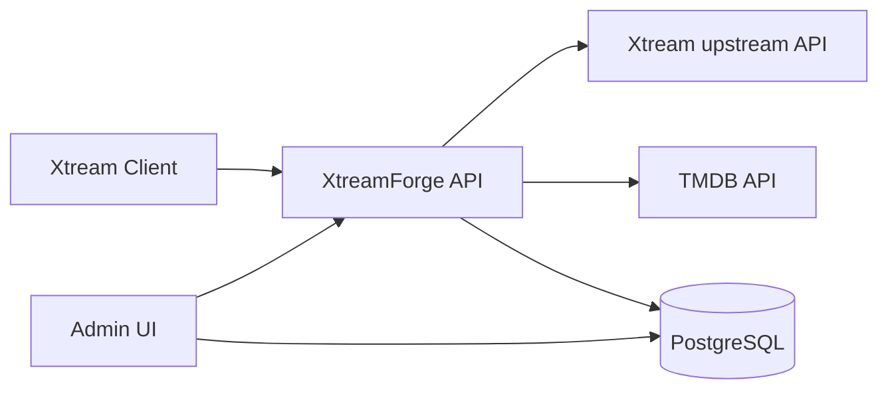

# XtreamForge

XtreamForge is an early-stage, self-hosted .NET application that will sit in front of an Xtream-compatible API and act as a transformation and enrichment layer.

> XtreamForge is an independent project and is not affiliated with Xtream Codes or TMDB.

## Current status

This repository currently provides the initial foundation only:

- ASP.NET Core Minimal API for future Xtream-compatible endpoints
- Blazor-based administration UI
- .NET Aspire orchestration
- PostgreSQL + EF Core infrastructure
- Docker Compose development setup
- xUnit test foundation

Future Xtream proxying, category mapping, TMDB lookup, metadata rewriting, and authentication are intentionally out of scope for this first PR.

## Architecture



### Projects

- `src/XtreamForge.Api` - Minimal API with health and status endpoints
- `src/XtreamForge.Admin` - Blazor admin UI with a simple dashboard
- `src/XtreamForge.Infrastructure` - EF Core, PostgreSQL wiring, options, migrations
- `src/XtreamForge.ServiceDefaults` - Aspire service defaults (OpenTelemetry, health checks, service discovery, resilience)
- `src/XtreamForge.AppHost` - Aspire orchestration for local development
- `tests/XtreamForge.Api.Tests` - API integration tests
- `tests/XtreamForge.Infrastructure.Tests` - Infrastructure-focused tests

## Prerequisites

- .NET SDK 10.0.x
- Docker (for PostgreSQL via Aspire or Docker Compose)

## Configuration

XtreamForge uses standard .NET configuration.

Placeholder configuration sections are present for future integrations:

- `Xtream:BaseUrl`
- `Xtream:Username`
- `Xtream:Password`
- `Tmdb:ApiKey`

Do not commit credentials.

For local secrets, prefer user-secrets or environment variables:

```bash
dotnet user-secrets --project src/XtreamForge.Api set "Xtream:BaseUrl" "https://example.test"
dotnet user-secrets --project src/XtreamForge.Api set "Xtream:Username" "your-user"
dotnet user-secrets --project src/XtreamForge.Api set "Xtream:Password" "your-password"
dotnet user-secrets --project src/XtreamForge.Api set "Tmdb:ApiKey" "your-tmdb-key"
```

Database connections are supplied through the standard `ConnectionStrings__database` setting.

## Run with .NET Aspire

From a clean clone:

```bash
dotnet restore
dotnet run --project src/XtreamForge.AppHost
```

The AppHost starts:

- PostgreSQL with persistent storage
- `XtreamForge.Api`
- `XtreamForge.Admin`
- the Aspire dashboard

## Run with Docker Compose

```bash
docker compose up --build
```

This starts PostgreSQL, the API, and the Admin UI.

Development-only defaults are used in `docker-compose.yml`:

- PostgreSQL database: `xtreamforge`
- PostgreSQL username: `postgres`
- PostgreSQL password: `postgres`

Override them for any non-local usage.

## PostgreSQL notes

- Aspire injects the database connection into the applications.
- Docker Compose supplies the same connection via environment variables.
- The API applies EF Core migrations on startup by default.

## Useful endpoints

- API status: `http://localhost:8080/api/status`
- API health: `http://localhost:8080/health`
- Admin UI: `http://localhost:8081/`

## Test

```bash
dotnet restore
dotnet build
dotnet test
```

The current test suite does not require a locally installed PostgreSQL instance.

## Known limitations

- No Xtream proxy/authentication behavior yet
- No category remapping yet
- No TMDB client or enrichment yet
- No admin authentication yet
- No background jobs yet

## Suggested next steps

1. Add upstream Xtream client primitives.
2. Introduce category mapping persistence and admin workflows.
3. Add TMDB lookup/enrichment services.
4. Expand API compatibility coverage and health reporting.
