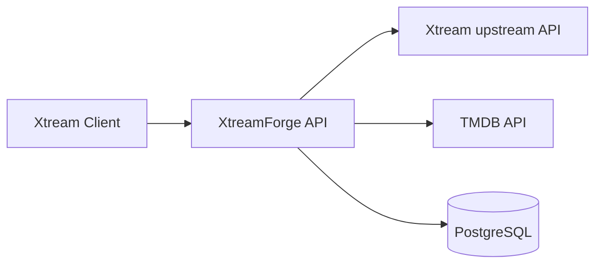

# XtreamForge

XtreamForge is an early-stage, self-hosted .NET application that will sit in front of an Xtream-compatible API and act as a transformation and enrichment layer.

> XtreamForge is an independent project and is not affiliated with Xtream Codes or TMDB.

## Current status

This repository currently provides the initial foundation plus the first category-management feature:

- ASP.NET Core application combining Minimal APIs and integrated server-side interactive administration UI
- Initial Xtream request routing, classification, and transparent forwarding foundation
- Database-backed VOD/Series category discovery and category rewriting
- .NET Aspire orchestration
- PostgreSQL + EF Core infrastructure
- Docker Compose development setup
- xUnit test foundation

TMDB lookup, metadata rewriting, and authentication are intentionally out of scope for the current implementation.

## Architecture



### Projects

- `src/XtreamForge.Api` - Minimal APIs plus integrated admin UI with health and status endpoints
- `src/XtreamForge.Infrastructure` - EF Core, PostgreSQL wiring, options, migrations
- `src/XtreamForge.ServiceDefaults` - Aspire service defaults (OpenTelemetry, health checks, service discovery, resilience)
- `src/XtreamForge.AppHost` - Aspire orchestration for local development
- `tests/XtreamForge.Api.Tests` - API integration tests
- `tests/XtreamForge.Infrastructure.Tests` - Infrastructure-focused tests

## Prerequisites

- .NET SDK 10.0.x
- Docker (for PostgreSQL via Aspire or Docker Compose)

## Configuration

XtreamForge uses standard .NET configuration.

Placeholder configuration sections are present for future integrations:

- `Xtream:BaseUrl`
- `Xtream:Username`
- `Xtream:Password`
- `Tmdb:ApiKey`
- `XtreamProxy:AllowAnyDestination`
- `XtreamProxy:AllowedHosts`

Do not commit credentials.

For local secrets, prefer user-secrets or environment variables:

```bash
dotnet user-secrets --project src/XtreamForge.Api set "Xtream:BaseUrl" "https://example.test"
dotnet user-secrets --project src/XtreamForge.Api set "Xtream:Username" "your-user"
dotnet user-secrets --project src/XtreamForge.Api set "Xtream:Password" "your-password"
dotnet user-secrets --project src/XtreamForge.Api set "Tmdb:ApiKey" "your-tmdb-key"
```

Database connections are supplied through the standard `ConnectionStrings__database` setting.

Proxy destination control is configured through `XtreamProxy`:

- `AllowAnyDestination`: development convenience switch; leave `false` outside trusted local development
- `AllowedHosts`: explicit upstream DNS/IP allowlist used when `AllowAnyDestination` is `false`

## Run with .NET Aspire

From a clean clone:

```bash
dotnet restore
dotnet run --project src/XtreamForge.AppHost
```

The AppHost starts:

- PostgreSQL with persistent storage
- `XtreamForge.Api` (serving both API and administration UI)
- the Aspire dashboard

## Run with Docker Compose

```bash
docker compose up --build
```

This starts PostgreSQL and the single XtreamForge web service, which serves both the API and the administration UI.

Development-only defaults are used in `docker-compose.yml`:

- PostgreSQL database: `xtreamforge`
- PostgreSQL username: `postgres`
- PostgreSQL password: `postgres`

Override them for any non-local usage.

## PostgreSQL notes

- Aspire injects the database connection into the application.
- Docker Compose supplies the same connection via environment variables.
- The API attempts EF Core migrations in the background on startup by default.

## Xtream proxy

Xtream clients should call XtreamForge using a URL that embeds the original upstream destination:

```text
http://localhost:8080/{protocol}/{host}/{port}/{rest}?username=USER&******
```

Examples:

```text
http://localhost:8080/http/example.com/8080/player_api.php?username=user&******
http://localhost:8080/https/example.com/443/player_api.php?username=user&******
```

Current behavior:

- XtreamForge validates `protocol`, `host`, and `port`
- `get_vod_categories` and `get_series_categories` are fetched from upstream and rewritten from PostgreSQL-backed rules
- `get_vod_streams` and `get_series` use effective XtreamForge category mappings and return XtreamForge category IDs
- `get_vod_info` and `get_series_info` rewrite category references to XtreamForge category IDs
- other recognized `player_api.php` actions are classified for future transformation
- all non-category requests are currently forwarded upstream unchanged
- request methods, bodies, headers, query strings, and streamed responses are preserved where appropriate

Recognized `player_api.php` actions:

- `get_vod_categories`
- `get_series_categories`
- `get_vod_streams`
- `get_series`
- `get_vod_info`
- `get_series_info`

Transparent fallback behavior:

- known non-category action -> forwarded upstream unchanged
- unknown `player_api.php` action -> forwarded upstream unchanged
- `player_api.php` without `action` -> forwarded upstream unchanged
- non-`player_api.php` request -> forwarded upstream unchanged

Security notes:

- Xtream credentials in the query string are preserved for upstream forwarding but are not intentionally logged or persisted by this proxy layer.
- The proxy route allows a client to choose the upstream destination, which has SSRF implications. XtreamForge currently enforces an explicit destination validation policy for protocol, host, port, and configured upstream host authorization.
- IPv4 addresses and DNS hostnames are supported in the route format today.
- IPv6 literals are not currently supported by this path-based route format.
- The generic Xtream proxy route is excluded from generated OpenAPI documentation to avoid misleading native API descriptions.

## Category management

XtreamForge persists category discovery, category mappings, and category rules in PostgreSQL.

Category model:

- upstream categories are source-specific and scoped by upstream destination (`protocol` + `host` + `port`) plus content type (`Vod` / `Series`)
- custom categories are global across sources and scoped by content type only
- VOD and Series custom-category namespaces are separate
- rule scope remains source + content type

Mapping choices in the admin grid:

- `Disabled` - manual disable override; the upstream category stays discovered but is not exposed
- `Original` - expose the upstream category with its source-specific original name and stable XtreamForge ID
- `New category` - create one new global custom category and map the row to it
- `Existing custom category` - map the upstream category to an existing global custom category

Effective precedence:

1. Manual Disabled
2. Rules (first enabled matching rule wins)
3. If still enabled, apply the current mapping (`Original` or `Custom Category`)

Current category capabilities:

- discover upstream VOD and Series categories on the first matching `player_api.php` request
- keep categories unchanged by default through `Original`
- manually disable categories without deleting discovery data
- map multiple source categories to one shared global custom category
- show the first matched rule for each source category
- persist stable XtreamForge category IDs across refreshes and restarts
- edit category mappings and rules interactively without full browser page reloads

How it works today:

1. Request `get_vod_categories` or `get_series_categories` through the Xtream proxy route.
2. XtreamForge fetches the upstream categories and stores the discovered source/category records.
3. Open the integrated admin UI and go to `Categories`.
4. Select the upstream source and content type.
5. Use the category grid to search/filter rows, then choose `Disabled`, `Original`, `New category`, or an existing custom category.
6. Manage rules and global custom categories in the same screen with inline save/delete feedback.
7. Repeat the category request to receive the rewritten category list with stable XtreamForge IDs.

Notes:

- Source identity is based on upstream destination only; credentials are not used as the source key and are not stored with category records.
- `get_vod_streams` and `get_series` translate XtreamForge output category IDs back to the currently effective upstream category IDs before querying/filtering results.
- returned stream and detail payloads expose XtreamForge category IDs instead of upstream category IDs.
- effective reverse mappings exclude upstream categories removed by manual disable or category rules.
- legacy source-local renamed/merged outputs are migrated into global custom-category records as safely as practical; identical legacy names are preserved rather than silently merged across sources.

## Category Rules

Category rules decide whether an upstream category participates in the effective XtreamForge catalogue before original/custom mapping is applied.

Rule behavior:

- rules are stored in PostgreSQL
- rules are scoped independently per upstream source and content type
- rules are evaluated sequentially in ascending order
- the first enabled matching rule wins
- matching supports `StartsWith` and `Contains`
- each rule can be case-sensitive or case-insensitive
- `Include` and `Exclude` actions are supported
- no matching rule means `Include`
- excluded categories remain discovered in PostgreSQL and are not deleted
- the Categories grid shows the first matched rule for each category
- administrators can edit, reorder, enable/disable, and delete rules inline from the Categories admin page

Manual category disable still takes precedence over rule evaluation.

Example:

| Order | Action  | Match      | Pattern       |
|------:|---------|------------|---------------|
| 10    | Include | Contains   | DOCUMENTAIRE  |
| 20    | Exclude | Contains   | SPORT         |
| 30    | Exclude | StartsWith | \|XXX\|       |

Category:

```text
|FR| DOCUMENTAIRE SPORT
```

Result:

```text
Included
```

Reason:

```text
Rule 10 matches first. Rule 20 is never used for this category.
```

## Stream and detail category translation

XtreamForge now applies the effective category model when processing:

- `get_vod_streams`
- `get_series`
- `get_vod_info`
- `get_series_info`

Behavior:

- Xtream clients send XtreamForge output category IDs.
- XtreamForge resolves those IDs to the effective included upstream category IDs for the selected source and content type.
- manual exclusions and category rules are respected before any reverse mapping is used.
- merged output categories are queried using only the currently included upstream category IDs.
- stream list results are filtered and rewritten so returned `category_id` values use XtreamForge IDs.
- detail results rewrite discovered `category_id` / `category_ids` values to XtreamForge IDs.

Example:

```text
Upstream:
10 -> |FR| 4K
20 -> |FR| UHD
30 -> |FR| COMEDIE

XtreamForge:
10 + 20 -> output 5 "4K Movies"
30      -> output 6 "Comedy"
```

If the client requests:

```text
player_api.php?action=get_vod_streams&category_id=5
```

XtreamForge resolves output category `5` back to the currently effective included upstream categories for that output category, queries/filter results accordingly, and returns items with `category_id=5`.

## Useful endpoints

- Dashboard UI: `http://localhost:8080/`
- API status: `http://localhost:8080/api/status`
- API health: `http://localhost:8080/health`

## Test

```bash
dotnet restore
dotnet build
dotnet test
```

The current test suite does not require a locally installed PostgreSQL instance.

## Known limitations

- Xtream rewriting currently focuses on category translation for category, stream, and detail actions
- Stream/info rewriting currently focuses on category translation only
- No TMDB client or enrichment yet
- No admin authentication yet
- No background jobs yet

## Suggested next steps

1. Add TMDB-aware rewriting for `get_vod_info` and `get_series_info`.
2. Add TMDB lookup/enrichment services.
3. Add admin authentication and auditing.
4. Expand API compatibility coverage and health reporting.
