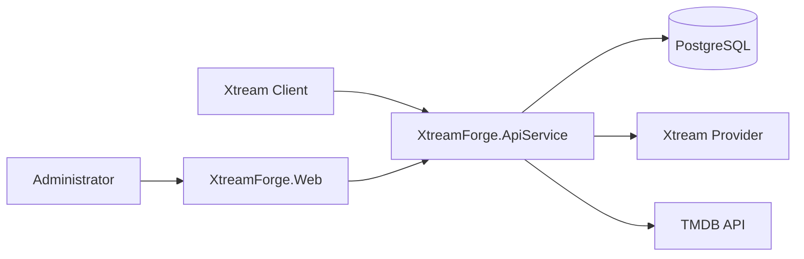

# XtreamForge

XtreamForge is an early-stage, self-hosted .NET application that sits in front of an Xtream-compatible API and acts as a transformation and enrichment layer.

> XtreamForge is an independent project and is not affiliated with Xtream Codes or TMDB.

## Current status

This repository currently provides:

- `XtreamForge.ApiService` backend with Minimal APIs, Xtream proxying, category and item processing, and TMDB ID and metadata enrichment
- `XtreamForge.Web` administration UI built as a Blazor Web App with Interactive Server rendering and Fluent UI
- PostgreSQL persistence with EF Core and Npgsql
- .NET Aspire orchestration
- xUnit v3 test coverage for backend behavior, admin API endpoints, and UI helpers

Metadata rewriting beyond categories, `tmdb_id`, the TMDB fields listed in [TMDB metadata](#tmdb-metadata), and the `server_info` of the [authentication response](#authentication-and-stream-urls) is out of scope for the current implementation, as is the authentication of the administration UI and API.

## Architecture


```mermaid
flowchart LR
    Client[Xtream Client] --> Api[XtreamForge.ApiService]
    Api --> Db[(PostgreSQL)]
    Api --> Upstream[Xtream Provider]
    Api --> Tmdb[TMDB API]

    Admin[Administrator] --> Web[XtreamForge.Web]
    Web --> Api
```

### Design principles

- **Blazor Interactive Server** for the administration UI
- **Backend-owned business logic** for category discovery, rules, mappings, Xtream transformations, and TMDB matching
- **Feature-oriented organization** inside `XtreamForge.Web` so each feature keeps its UI and HTTP client code together
- **KISS** over ceremony
- **Pragmatic SOLID** without repository layers, MediatR, CQRS infrastructure, AutoMapper, or interface-plus-implementation pairs that add no value

### Projects

- `src/XtreamForge.ApiService` - ASP.NET Core backend: Minimal APIs, Xtream proxy, application services, TMDB client and background retrieval
- `src/XtreamForge.Domain` - domain entities and enums, free of infrastructure dependencies
- `src/XtreamForge.Database` - EF Core `XtreamForgeDbContext`, entity mappings, and PostgreSQL migrations
- `src/XtreamForge.Web` - Blazor Web App for the administration UI (Interactive Server, Fluent UI)
- `src/XtreamForge.ServiceDefaults` - Aspire service defaults (OpenTelemetry, health checks, service discovery, resilience, credential redaction)
- `src/XtreamForge.AppHost` - Aspire orchestration for local development
- `tests/XtreamForge.Tests` - unit and endpoint tests (SQLite in-memory for database-backed tests)

## Prerequisites

- .NET SDK 10.0.x (see `global.json`)
- Docker (for PostgreSQL via Aspire)

## Configuration

XtreamForge uses standard .NET configuration.

Backend (`XtreamForge.ApiService`):

- `XtreamProxy:AllowAnyDestination` - development convenience switch allowing any upstream host whose addresses are all publicly routable; leave `false` outside trusted local development
- `XtreamProxy:AllowedHosts` - explicit upstream DNS/IP allowlist; a listed host is always allowed, even when it resolves to a private address
- `Tmdb:ApiKey` - TMDB API read access token (Bearer); when empty, the TMDB search is skipped
- `Tmdb:BaseUrl` - TMDB API base URL (`https://api.themoviedb.org/3/` in `appsettings.json`); required and validated at startup
- `Tmdb:ImageBaseUrl` - TMDB image base URL used for the posters (default `https://image.tmdb.org/t/p/`); must be an absolute HTTP(S) URL, validated at startup
- `Tmdb:PreferredLanguage` - language used for TMDB searches and details (default `fr-FR`)
- `Tmdb:MinimumConfidenceScore` - minimum score for a TMDB match to be accepted (default `85`)
- `Recommendations:CategoryName` - name of the VOD recommendations category (`RECOMMANDATIONS` in `appsettings.json`); the category is disabled when empty, see [Recommendations category](#recommendations-category)
- `Recommendations:CategoryId` - XtreamForge ID of the recommendations category (default `999999999`); must be positive (validated at startup) and must not be the ID of an Xtream or custom category
- `Popular:CategoryName` - name of the VOD and series popular category (`POPULAIRES` in `appsettings.json`); the category is disabled when empty, see [Popular category](#popular-category)
- `Popular:CategoryId` - XtreamForge ID of the popular category (default `999999998`); must be positive (validated at startup) and must not be the ID of an Xtream, custom, or recommendations category
- `ConnectionStrings:database` - PostgreSQL connection string (supplied by Aspire)

Web (`XtreamForge.Web`):

- `Backend:BaseUrl` - backend base URL (default `https://xtreamforge-apiservice`, resolved through Aspire service discovery)

Do not commit credentials. Upstream Xtream credentials are neither configured nor stored: they travel in the client requests.

For local secrets, prefer user-secrets or environment variables:

```bash
dotnet user-secrets --project src/XtreamForge.ApiService set "Tmdb:ApiKey" "your-tmdb-read-access-token"
```

## Run with .NET Aspire

```bash
dotnet restore
dotnet run --project src/XtreamForge.AppHost
```

The AppHost starts:

- PostgreSQL with a persistent data volume (`xtreamforge-postserv-data`) and pgAdmin
- `XtreamForge.ApiService` (waits for the database)
- `XtreamForge.Web` (waits for the backend and reaches it through service discovery)
- the Aspire dashboard

## PostgreSQL notes

- Aspire injects the `database` connection into the backend.
- The backend applies EF Core migrations at startup.
- The Web project does **not** access PostgreSQL directly.

## Xtream proxy

Xtream clients call XtreamForge using a URL that embeds the original upstream destination:

```text
{xtreamforge-base-url}/{protocol}/{host}/{port}/{rest}?username=USER&password=PASSWORD
```

Example:

```text
{xtreamforge-base-url}/http/example.com/8080/player_api.php?username=user&password=pass&action=get_vod_streams
```

Only `GET` and `HEAD` requests are accepted. Several routes share this URL shape: `/{protocol}/{host}/{port}/player_api.php` (case-insensitive) is handled by XtreamForge as described below, and every other path (streams, other files) is forwarded upstream by separate routes that do not load any XtreamForge data (movie streams are only reported in memory to the [watch history](#watch-history)). The short live form `/{protocol}/{host}/{port}/{username}/{password}/{streamId}` has its own route, only so that its credentials are known from the route values and redacted; it is forwarded like any other path.

Behavior by `player_api.php` action:

- `get_vod_categories` / `get_series_categories` - fetched from upstream, synchronized in PostgreSQL, filtered by category rules, and returned with XtreamForge category IDs; they start with the virtual categories: recommendations (VOD only), then popular
- `get_vod_streams` / `get_series` - see [Catalogue processing](#catalogue-processing)
- `get_vod_info` / `get_series_info` - see [Item details](#item-details)
- no action (authentication) - see [Authentication and stream URLs](#authentication-and-stream-urls)
- any other action, or a non-`player_api.php` request - forwarded upstream unchanged (status, headers including `Content-Length`, and streamed body preserved)

Upstream failures: an upstream timeout returns `504 Gateway Timeout`, and a network error, an interrupted body, or invalid JSON returns `502 Bad Gateway`. When the failure happens after the response has started (streamed list or body), its status can no longer change, so the connection is aborted and the client sees a truncated response rather than a complete one. The failure is logged with the action and the upstream host.

Security notes:

- XtreamForge validates `protocol`, `host`, and `port`, and enforces the `XtreamProxy` host allowlist (SSRF protection); with `AllowAnyDestination`, the addresses are checked when the Xtream HTTP client connects (not only when the request is validated), so a host resolving to a non-public address, even after a DNS change, is refused (`502 Bad Gateway`). For this check to apply, the Xtream HTTP client ignores the system HTTP proxy settings
- Xtream credentials are forwarded upstream but are not persisted; they are redacted (`***`) from the request spans and from the request logs of the Xtream HTTP client, in the query string, in the stream paths (`movie|series|live|timeshift/{username}/{password}/...`), and in the short live form (from the `username` / `password` route values, once the request is routed)
- the ASP.NET Core request logs and their log scope (`RequestPath`, attached to every log of a request) write the raw path, so `Microsoft.AspNetCore.Hosting.Diagnostics` is disabled in code (`LogLevel.None`) whatever the configured log levels; the redacted spans describe the requests instead
- the Xtream proxy routes are excluded from generated OpenAPI documentation

## Authentication and stream URLs

Some clients build the stream URLs from the `server_info` of the authentication response (`{server_protocol}://{url}:{port}/movie/{username}/{password}/{id}.{extension}`), which would bypass XtreamForge. For `player_api.php` without `action` (`GET` only):

- the upstream response is fetched; an error status is forwarded unchanged
- when `user_info.auth` is `1`, `server_info.url`, `port`, `https_port`, and `server_protocol` are replaced with the host, port, and scheme of the request received by XtreamForge, and the upstream (`protocol` + `host` + `port`) of the account is remembered in memory (`XtreamAccountDirectory`, keyed by username and password, never persisted); the rest of the payload is unchanged
- `/movie/{username}/{password}/{file}`, `/series/...`, and `/live/...` (without upstream prefix) are forwarded to the upstream of the account like the prefixed stream route (same destination validation, [watch history](#watch-history) included); an account that has not authenticated since XtreamForge started returns `404 Not Found`

## Watch history

Every movie played through the proxy is recorded with its TMDB ID, its content type, and the start date of the playback; a movie played several times appears once per playback. The history is global: neither the Xtream account nor the source is stored.

- a playback starts with a `GET` of a movie stream, `movie/{username}/{password}/{streamId}.{extension}` with or without the upstream prefix, that the provider serves or redirects (redirects are forwarded to the client, which then calls the redirect target directly) (`HEAD` requests, series episodes, and live streams are not recorded)
- a player sends several requests for one playback (range requests, seeks, reconnections): a request starts a new playback only when no request of the same movie and account is running and the last one ended more than 30 minutes ago; this state is kept in memory by the singleton `WatchHistoryQueue`, so the stream route does not access the database
- the playbacks are recorded in the background by `WatchHistoryBackgroundService`: the TMDB ID is the persisted mapping of the stream when it exists, otherwise the `tmdb_id` of the provider `get_vod_info` payload (called with the credentials of the stream URL, kept in memory only); a playback of an unknown source or of a movie without TMDB ID is not recorded
- `GET /api/admin/watch-history?contentType=&skip=&take=` - page (most recent first, at most 200 entries) of the history, with the title, original title, release date, and `w92` poster of the loaded TMDB metadata, and the number of matching entries; an invalid content type returns `400`
- `GET /api/admin/watch-history/activity?timeZone=` - number of movie playbacks per day (days without playback omitted) over the last 53 weeks, today included, the days being those of the given time zone (IANA or Windows ID, UTC when empty; an unknown time zone returns `400`)
- `DELETE /api/admin/watch-history/{id}` - deletes one playback (`204`, or `404` when unknown); from the `Watch history` screen
- `POST /api/admin/tmdb-infos/{id}/watch-history` - records a playback of a TMDB metadata entry started now and returns it (`404` for an unknown entry); from the details of an entry on the `TMDB infos` screen

### Recommendations

Movies are recommended from the watch history, computed on each request (nothing is stored):

- the TMDB recommendations (`movie/{id}/recommendations`, first page, in `Tmdb:PreferredLanguage`) of the 20 most recently watched distinct movies are requested; without `Tmdb:ApiKey`, the list is empty
- a movie of the watch history is never recommended, nor a movie whose TMDB metadata is excluded manually
- each watched movie gives its recommendations a weight (20 for the most recent, down to 1); the 50 best summed weights are returned, then by vote average
- a recommendation is flagged as available in the catalogue when TMDB metadata is known for it (TMDB rules are not applied)
- `GET /api/admin/recommendations` - the recommendations with title, original title, release date, `w92` poster, vote average and count, English genre names, score, number of watched movies recommending it, and the catalogue flag

### Recommendations category

When `Recommendations:CategoryName` is set, the recommended movies are exposed to the Xtream clients in a virtual VOD category:

- `get_vod_categories` returns it first, with the ID `Recommendations:CategoryId`
- `get_vod_streams` with all the categories (`category_id` missing, empty, or `ALL`): a recommended movie is returned in the recommendations category (`category_id` and `category_ids` rewritten) instead of its own category
- `get_vod_streams` with the recommendations `category_id`: the provider is called once with `category_id=ALL` and only the recommended movies are returned, in the recommendations category
- a TMDB ID appears only once in a virtual category: when several streams share it, the first one returned by the provider (after the rules and the TMDB filtering) takes the virtual category, the next ones keep their own category
- `get_vod_info` / `get_series_info` always return the item in its own category, as they cannot know which stream of a TMDB ID is listed in the virtual category
- `get_vod_streams` with another category keeps the category of the recommended movies
- the TMDB IDs of the recommended movies are kept in memory for 6 hours (`TmdbIdCache`) and recomputed when the watch history changes (playback recorded, added, or deleted); when TMDB fails, the catalogue is returned without recommendation and the next request tries again

### Popular category

When `Popular:CategoryName` is set, the movies and TV shows currently popular on TMDB (`movie/popular` / `tv/popular`, first 5 pages, i.e. up to 100 titles per content type) are exposed in a virtual category, for VOD and series:

- `get_vod_categories` / `get_series_categories` return it after the recommendations category, with the ID `Popular:CategoryId`
- with all the categories (`get_vod_streams` / `get_series`), a popular item is moved to the popular category, unless it is a recommended movie: the recommendations category wins
- `get_vod_streams` / `get_series` with the popular `category_id`: the provider is called once with `category_id=ALL` and only the popular items are returned, in the popular category (recommended movies included)
- as for the recommendations, only the first stream of a TMDB ID is in the popular category, and `get_vod_info` / `get_series_info` keep the item in its own category
- the popular TMDB IDs are kept in memory for 6 hours per content type (`TmdbIdCache`); without `Tmdb:ApiKey` the category is empty; when TMDB fails, the catalogue is returned without popular item and the next request tries again

## Sources

A source is identified by its upstream destination (`protocol` + `host` + `port`); credentials are not part of the source key and are never stored.

A source is created either:

- from the admin UI (`Sources` screen / `POST /api/admin/sources`): the URL and credentials are used once to discover VOD and Series categories, then discarded; nothing is saved when the provider is unreachable
- implicitly on the first `get_vod_categories` / `get_series_categories` request going through the proxy; when parallel requests synchronize the same new source or category (clients often request the VOD and series categories together), the one rejected by the unique indexes synchronizes again once and updates what the other inserted

`get_vod_streams` / `get_series` require an already known source; otherwise XtreamForge returns `400 Bad Request` without calling the provider.

Deleting a source removes its Xtream categories, rules, and TMDB mappings, but keeps the global custom categories.

## Category management

Category model:

- upstream categories are source-specific and scoped by content type (`Vod` / `Series`)
- custom categories are global across sources and scoped by content type only
- categories no longer returned by the provider are disabled, not deleted
- an upstream category loses its custom category mapping when the provider renames it (a change of case only is ignored), stops returning it, or returns it again after having stopped; it is then exposed with its original name until it is mapped again
- rules are scoped by source and content type

For each upstream category, the admin UI allows to:

- exclude it manually without deleting discovery data
- expose it with its original name and a stable XtreamForge ID
- map it to a global custom category (several source categories can share one custom category)
- see the effective decision and its reason (manual exclusion, provider disabled, or deciding rule)

Effective precedence:

1. manual exclusion and categories disabled by the provider
2. category rules (first enabled matching rule wins)
3. if still included, the mapping (original or custom category)

## Rules

Category, item, and TMDB rules share the same model:

- stored in PostgreSQL; category and item rules are scoped per source and content type, TMDB rules are global per content type
- evaluated in ascending sequence; the first enabled matching rule wins
- operators: `StartsWith`, `Contains`, `NotStartsWith`, `NotContains`
- case-sensitive or case-insensitive matching
- actions: `Include` / `Exclude`; no matching rule means `Include`
- the admin UI can create, edit, reorder, enable/disable, and delete rules; a new order is saved atomically (`PUT .../category-rules/order`, `.../item-rules/order`, or `/api/admin/tmdb-rules/order`)
- the admin API validates a created or updated rule (defined content type, action, and operator, a pattern of 1 to 255 characters, and the `field` of a TMDB rule) and returns `400` otherwise; the three kinds of rules are returned with the same representation (`xtreamSourceId` is null and `field` is set for a TMDB rule)

Category rules match the category name. Item rules match the item `name` sent by the provider; items without a name are always excluded. TMDB rules match the TMDB title or genres of the item, see [TMDB rules](#tmdb-rules).

## Catalogue processing

For `get_vod_streams` and `get_series`:

1. Xtream clients send XtreamForge category IDs; they are resolved to the effective included upstream category IDs (manual exclusions and category rules are respected).
2. A `category_id` that is not a number or matches no included category returns `400 Bad Request`. A missing, empty, or `ALL` `category_id` means all categories: XtreamForge sends one upstream request with `category_id=ALL`. Otherwise a single upstream request is also sent: with the upstream category ID when the requested category maps to one upstream category, or with `category_id=ALL` filtered through the mapping when it maps to several (custom category).
3. Items are processed in a streaming way (parsed once, response flushed in chunks, as `application/json; charset=utf-8`, so that the response compression applies):
   - items whose category is not effectively included are removed, and `category_id` / `category_ids` are rewritten to XtreamForge IDs
   - item rules are applied
   - a TMDB ID must be known (see below), otherwise the item is removed from the current response
   - duplicated items are removed
   - by batches of 500 items, the loaded TMDB metadata of the batch is read with one query and applied (see [TMDB metadata](#tmdb-metadata)); an item whose metadata is not loaded (or whose `tmdb_id` is not a positive number) is removed from the current response, as is an item whose TMDB metadata is excluded manually or by a TMDB rule (see [TMDB rules](#tmdb-rules)); the item rules are not applied again

Item rules, TMDB mappings, and deferred TMDB lookups are preloaded once per request (`Source + ContentType`) into in-memory dictionaries and sets to avoid per-item database lookups.

## Item details

For `get_vod_info` and `get_series_info`, the item is returned only if it would appear in `get_vod_streams` / `get_series`:

1. A missing or empty `vod_id` / `series_id` returns `400 Bad Request`, as does an unknown source (request the categories first).
2. The upstream payload is fetched with the original query string and parsed as a whole (it describes a single item).
3. The item fields are read from `movie_data` for VOD and from `info` for series: its `category_id` must belong to an effectively included category and is rewritten to the XtreamForge ID (`category_ids` too, and `info.category_id` for VOD), then the item rules are applied.
4. A TMDB ID must be known: the persisted mapping of the stream wins (it may have been corrected manually) and is injected as `info.tmdb_id` (and replaces `movie_data.tmdb_id` for VOD when present); otherwise the provider `tmdb_id` (`info`, or `movie_data` for VOD) is kept. No TMDB ID lookup is enqueued from this action.
5. The TMDB metadata must be loaded: it is applied to `info` and `movie_data` for VOD, and to `info` for series (see [TMDB metadata](#tmdb-metadata)); the item is not returned when its TMDB metadata is excluded manually or by a TMDB rule.

When the item would not be listed, the empty payload of Xtream panels is returned with `200 OK`: `{"info":[],"movie_data":[]}` for VOD, `{"seasons":[],"info":[],"episodes":[]}` for series. Other fields (seasons, episodes, metadata) are returned unchanged; an upstream error status is forwarded.

Unlike the lists, only the TMDB mapping of the requested stream is read, not every mapping of the source.

## TMDB enrichment

An item is returned only when a usable TMDB ID is known and its TMDB metadata is loaded (see [TMDB metadata](#tmdb-metadata)). The TMDB ID comes from either:

- the upstream list item already exposing `tmdb_id`
- a persisted `Source + ContentType + StreamId -> TmdbId` mapping (injected as `tmdb_id`)

When no TMDB ID is known and no lookup is deferred for the stream, XtreamForge enqueues a background lookup (`TmdbIdRetrieverBackgroundService`):

- the queue is bounded and deduplicated per `Source + ContentType + StreamId`
- the upstream credentials are kept in memory only while the lookup is pending
- the worker calls `get_vod_info` / `get_series_info` on the same upstream source and uses `info.tmdb_id` (and `movie_data.tmdb_id` for VOD) when present
- otherwise, when `Tmdb:ApiKey` is configured, it searches TMDB and scores the candidates
- a found TMDB ID is persisted so the item appears on a later request
- a lookup without result or failing (provider or TMDB error) is persisted as a mapping without TMDB ID (`stream_tmdb_mappings.tmdb_id` is null) with an attempt count and the date of the next lookup; the item is not enqueued again before that date. The delay is 1 day after the first attempt and doubles on each new attempt, up to 30 days
- a found TMDB ID, from the provider or from the TMDB search, is enqueued for the background load of its TMDB metadata, see below

TMDB matching (`Services/Tmdb`):

1. The provider title is cleaned (language/technical tags, delimited year) and the item is ignored when it is not scorable (no title, or a title without date, poster, cast, or genres).
2. `search/movie` or `search/tv` is called with the release year, then without it when nothing is found; the lookup stops with 0 or more than 5 candidates.
3. The details (`movie/{id}` / `tv/{id}` with credits) of each candidate are scored by the registered `ITmdbScoringRule` implementations:
   - basic stage: title (35), poster identical to the provider poster or `stream_icon` (40), release date (25), cast (10), genres (10, compared with localized and English TMDB genre names), single candidate (10)
   - advanced stage, only when the basic score reaches 60: seasons and episodes for series (20, additional `tv/{id}/season/{n}` calls)
4. The best candidate is kept when its score reaches `Tmdb:MinimumConfidenceScore`.

A new scoring rule is added by implementing `ITmdbScoringRule` and registering it in `DependenciesExtensions`.

Upstream rate limiting (TMDB and Xtream providers): every request of the TMDB and Xtream HTTP clients goes through `RateLimitHandler`, with one state per upstream host (scheme, host, port) in the singleton `UpstreamRateLimiter`. Requests to a host are not delayed until it answers HTTP 429; then its next requests are paused (`Retry-After` is honored, capped at one minute) and spaced by an interval that doubles on each 429 (1 s up to 30 s) and shrinks by 10% after each response that is not rate limited. A rate-limited GET/HEAD request is sent again up to three times in total; the last 429 response is then returned unchanged (the proxy forwards it to the client, background TMDB lookups fail and are logged as a warning). The standard resilience pipeline neither retries 429 nor counts it for its circuit breaker.

The dashboard shows the number of known TMDB mappings and of unresolved lookups (mappings without TMDB ID).

The persisted mappings can be corrected, and the unresolved ones mapped manually, from the `TMDB mappings` screen of the Items section. A TMDB ID set manually is never looked up again and its TMDB metadata is enqueued for loading. Items whose upstream list entry already exposes `tmdb_id` have no mapping and cannot be corrected this way.

Admin API:

- `GET /api/admin/sources/{sourceId}/tmdb-mappings?contentType=&search=&isMapped=&skip=&take=` - page (most recent first, at most 200 entries) of the mappings of a source and content type, with the title, original title, release date, and `w92` poster of the loaded TMDB metadata, and counters (total, mapped) over the source and content type; the search matches the exact stream ID, the exact TMDB ID, or the TMDB title or original title (ignoring case); an invalid content type returns `400`, an unknown source `404`
- `PATCH /api/admin/tmdb-mappings/{id}` with `{ tmdbId }` - sets the TMDB ID of a mapping; a TMDB ID that is not positive returns `400`, an unknown mapping `404`

## TMDB metadata

The TMDB metadata of movies and TV shows is stored in `tmdb_infos`, one entry per `ContentType + TmdbId` (movie and TV IDs overlap): title, original title, release date, poster path, overview, vote average, vote count, genres, directors, cast, and duration, in the `Tmdb:PreferredLanguage` language. Genres are stored as TMDB genre IDs with their English names (`TmdbGenres`, unknown IDs have no name). Directors are the creators for a TV show, the cast is limited to the first 10 members in credit order, and the duration is in minutes (movie `runtime`, or TV `episode_run_time` falling back to the runtime of the last aired episode). Every value is optional; TMDB values are sanitized (blank texts dropped, long texts truncated, ratings outside 0-10 ignored).

Entries are only filled from the TMDB details (`movie/{id}` / `tv/{id}` with `append_to_response=credits`), loaded in the background by `TmdbInfoBackgroundService` through the in-memory `TmdbInfoQueue`, deduplicated per `ContentType + TmdbId`. A load is enqueued when a TMDB ID lookup finds a TMDB ID (from the provider or from the TMDB search), and when a returned item needs it (see below). A request for an entry already loaded and not due for a refresh (or waiting for a retry) is ignored.

When an item with a TMDB ID is returned (lists and item details) and its metadata is missing, or due for a refresh or a retry, a background load is enqueued (only when `Tmdb:ApiKey` is configured). An item is returned only once its metadata is loaded: without it, the item is removed from the current response and appears on a later request; while a refresh is pending, the stored metadata is used. Loaded metadata is refreshed after 60 days. When TMDB does not know the ID or the load fails, the next load is deferred by 1 day, doubling on each new attempt up to 30 days; already loaded metadata is kept.

The provider values and the TMDB metadata are merged: the metadata replaces only the keys already present in the provider item, and only with available values, so a provider value is kept when TMDB has none; when both have a value, the TMDB value wins, except for `genre` (the JSON kind of numeric provider values is kept):

- `name`, `o_name`, `title` - `{Title} | {Year}` (or `{Title}` without release date)
- `year`, `release_date` - release year; `releasedate`, `releaseDate` - release date (`yyyy-MM-dd`)
- `stream_icon` - poster `w342`; `movie_image`, `cover_big`, `cover` - poster `w780`
- `rating` - vote average (one decimal), `rating_5based` - vote average / 2; only when the vote count is positive
- `plot`, `description` - overview
- `director` - directors (creators for a TV show), separated by `, `; `cast`, `actors` - cast, separated by `, `
- `duration_secs` - duration in seconds, `duration` - `HH:MM:SS`, `episode_run_time` - minutes
- `genre` - only when the provider value is empty, `null`, or `[]`: English TMDB genre names separated by `, ` (the provider genre is otherwise kept, the stored genres being English while the other metadata uses `Tmdb:PreferredLanguage`)

## TMDB rules

TMDB metadata entries can be excluded, for every source:

- manually, with the `IsExcluded` flag of the entry (`tmdb_infos.is_excluded`), from the `TMDB infos` screen
- by TMDB rules (`tmdb_rules`), global per content type, which match the TMDB `Title` or `Genre` of the entry; a genre rule is evaluated per genre (the stored English names): `StartsWith` and `Contains` match when at least one genre matches, `NotStartsWith` and `NotContains` when no genre does (for example, exclude the items whose genre contains `Horror`)

A manual exclusion wins; otherwise the first enabled matching TMDB rule by ascending sequence decides, and an entry no rule matches is included. TMDB rules are evaluated after the enrichment metadata is known and replace a second evaluation of the item rules. The enabled TMDB rules of the content type are loaded once per catalogue request; for the manually excluded entries, only their TMDB IDs are loaded (no metadata, no background load), and their items are not returned.

Admin API:

- `GET /api/admin/tmdb-infos?contentType=&search=&genre=&decision=&isExcluded=&isLoaded=&skip=&take=` - page (sorted by title, at most 200 entries) of the TMDB metadata of a content type with the decision of each entry, and counters and genre names (sorted) over the whole content type; the search matches the title, the original title, or the exact TMDB ID, the genre one of the genre names (ignoring case); posters are returned as `w92` and `w342` URLs
- `GET /api/admin/tmdb-infos/{id}` - every value of an entry (overview, directors, cast, duration) with its decision
- `PATCH /api/admin/tmdb-infos/{id}` with `{ isExcluded }` - sets the manual exclusion
- `GET /api/admin/tmdb-rules?contentType=`, `POST /api/admin/tmdb-rules`, `PUT|DELETE /api/admin/tmdb-rules/{id}`, `PUT /api/admin/tmdb-rules/order` - same contracts as the item rules, without source, with a `field` (`Title` or `Genre`); invalid values return `400`

## Background queue monitoring

Background queues (the TMDB ID lookup queue, the TMDB metadata queue, and the watch history queue) implement `IMonitoredQueue` and are sampled by `QueueMonitor` (`Services/Monitoring`):

- every 10 s, the size of each queue and the items processed since the previous sample (succeeded, no result, failed) are recorded; one hour of samples is kept in memory and lost on restart
- `GET /api/admin/queues` returns the current size and the history of each queue, and the upstream hosts that answered HTTP 429 since the API started (current spacing, number of 429)
- the Monitoring page (`/monitoring`) shows them live (refreshed every 5 s while the page is open): current size, peak and outcomes over the last hour, a chart of the waiting items and a chart of the processed items
- the same values are published as OpenTelemetry metrics by the `XtreamForge.ApiService` meter: `xtreamforge.queue.size` (gauge, tag `queue`), `xtreamforge.queue.items.processed` (counter, tags `queue` and `outcome`) and `xtreamforge.upstream.rate_limited` (counter, tag `host`); they are visible in the Aspire dashboard

## Administration UI

`XtreamForge.Web` is a Blazor Web App using Interactive Server rendering and Fluent UI components.

Boundaries:

- the Web project owns UI state and event handling
- the backend owns persistence and business rules
- the Web project calls the backend admin API (`/api/admin/...`) through typed `HttpClient`s

Features (`src/XtreamForge.Web/Features`):

- `Dashboard` - application and database status; configuration counters (sources, Xtream and custom categories, category, item, and TMDB rules) and TMDB counters (known mappings, unresolved lookups, TMDB infos, failed TMDB loads, i.e. entries whose first load failed and that wait for a retry, and manually excluded entries; the last two link to the filtered TMDB infos screen), and a heatmap of the movie playbacks per day over the last year (in the time zone of the Web server, like the dates of the watch history)
- `Monitoring` - live background queues (size, one hour charts) and upstream rate limits
- `History` - watch history (`/history`): the playbacks, most recent first, with their start date, TMDB title and poster (paged by the API), and a button to delete a playback
- `Recommendations` - movies recommended from the watch history (`/recommendations`), in the TMDB section with poster, genres, rating, number of watched movies recommending it, and availability in the catalogue
- `Sources` - list, create (with provider discovery), delete
- `Categories` - Xtream categories, custom categories, category rules; a click on an Xtream category opens its details (decision and deciding rule) where the manual exclusion and the custom category can also be changed
- `Items` - item rules, and TMDB mappings: the mappings of a source and content type (stream ID, TMDB title and poster, or the state of the background lookup when not found; filtered by search and mapped state, and paged by the API), whose edit button opens an editor to set the TMDB ID
- `Tmdb` - TMDB infos (poster, genres, rating, effective state and reason, manual exclusion; filtered by search, genre, state, and load state, and paged by the API) and TMDB rules; a click on an entry opens its details (decision and deciding rule, overview, directors, cast, and duration) where the manual exclusion can also be changed and a playback added to the watch history; the `New TMDB rule` button opens the rule editor prefilled with the search
- `Rules` - shared rules screen and rule editor (category, item, and TMDB rules)

## Useful endpoints

- Backend admin status: `/api/admin/status`
- Background queues and upstream rate limits: `/api/admin/queues`
- Health: `/health` (all checks) and `/alive` (liveness)

Ports are assigned by Aspire; use the Aspire dashboard to open the Web UI and the backend.

## Test

```bash
dotnet build XtreamForge.slnx
dotnet test --project tests/XtreamForge.Tests
```

Tests use xUnit v3 on Microsoft Testing Platform (configured in `global.json`) and do not require a PostgreSQL instance.

TRX reports and Cobertura code coverage are available through the Microsoft Testing Platform extensions:

```bash
dotnet test --solution XtreamForge.slnx --results-directory TestResults --report-trx --coverage --coverage-output-format cobertura
```

The GitHub Actions workflow (`.github/workflows/ci.yml`) restores, builds in Release, and runs the tests with these options on pull requests and pushes to `main`; the `TestResults` folder is uploaded as an artifact when the job fails.

## Known limitations

- items without a known TMDB ID are hidden until the background lookup succeeds
- an item whose lookup found nothing is looked up again only after its retry delay (up to 30 days), even if `Tmdb:ApiKey` is configured in the meantime
- the TMDB lookup and metadata queues are in memory: pending lookups and loads are lost on restart (missing metadata is enqueued again by the next catalogue request)
- the watch history only records movies, from the start of the playback, whatever the part actually watched; pending playbacks are lost on restart, and stream URLs that bypass XtreamForge are not recorded
- items are hidden until their TMDB metadata is loaded, so the first catalogue requests return few items; without `Tmdb:ApiKey`, no metadata is loaded and no item is returned
- changing `Tmdb:PreferredLanguage` only affects metadata loaded or refreshed afterwards
- while a provider rate limits (HTTP 429), proxied client requests to it wait for their slot (up to one minute per attempt, three attempts), which can exceed the timeout of some IPTV clients
- stream URLs without upstream prefix only work once the account has authenticated through XtreamForge since its last start, and use the host, port, and scheme of the request received by XtreamForge (a reverse proxy must forward the original `Host`; forwarded headers such as `X-Forwarded-Proto` are not processed); the short live form `/{username}/{password}/{id}` and `/timeshift/...` are not supported
- no admin authentication yet: the admin API is served by the same host and port as the Xtream proxy, so it must not be exposed to untrusted networks
- only local development through Aspire is supported: the ApiService is not declared as an external endpoint, and no deployment is documented; the Dockerfiles under `src/` build the ApiService and Web images from the repository root (for example `docker build -f src/XtreamForge.ApiService/Dockerfile .`), with the SDK of their base image (`global.json` is excluded from the Docker context)

Known bugs and design issues are tracked in [`TECHNICAL_DEBT.md`](TECHNICAL_DEBT.md).
